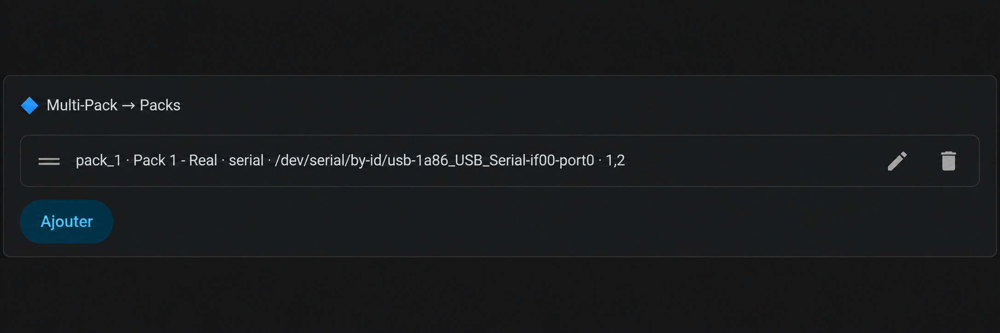
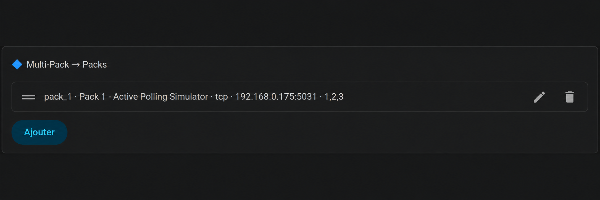
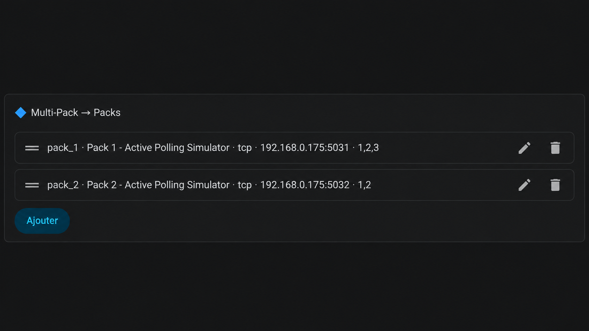
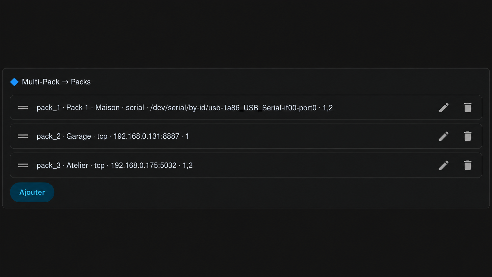
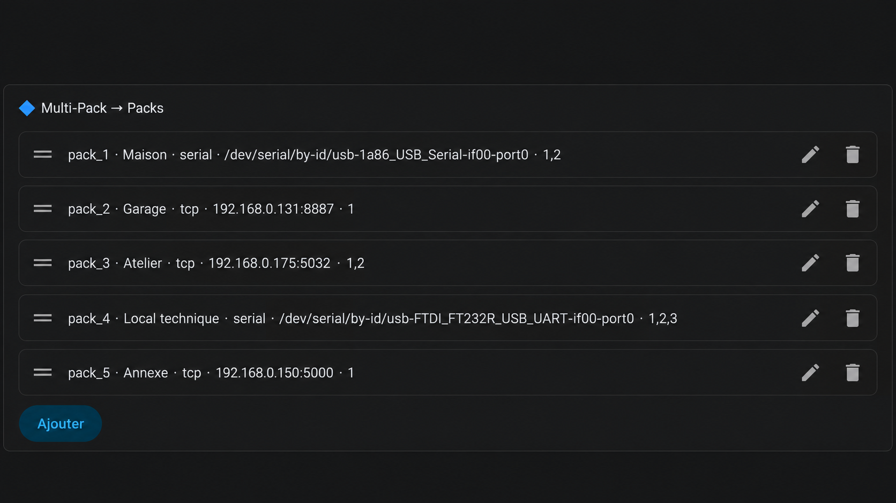

# Multi-Pack → Packs Configuration

The **Multi-Pack → Packs** section defines the JK-BMS communication interfaces used by the add-on.

Each pack represents one independent RS485 communication bus.

A pack can use:

- a local USB/RS485 adapter (`serial`)
- an RS485-to-TCP/IP gateway (`tcp`)

Each bus can contain one or several JK-BMS units.

---

## Pack fields

### `id`

Stable technical identifier for the pack.

Recommended values:

```text
pack_1
pack_2
pack_3
pack_4
pack_5
```

Do not change the pack ID after commissioning unless necessary.

---

### `name`

Friendly name displayed in Home Assistant and the dashboards.

Examples:

```text
Main battery
Garage
Technical room
Pack 1 - Real
```

---

### `transport`

Available values:

```text
serial
```

for a USB/RS485 adapter directly connected to Home Assistant.

or:

```text
tcp
```

for an RS485-to-TCP/IP gateway.

---

### `path`

Required when:

```text
transport: serial
```

Use a persistent device path whenever possible:

```text
/dev/serial/by-id/...
```

Example:

```text
/dev/serial/by-id/usb-1a86_USB_Serial-if00-port0
```

Avoid using `/dev/ttyUSB0` when possible, as this name may change after a reboot.

---

### `gateway_ip_port`

Required when:

```text
transport: tcp
```

Format:

```text
IP_ADDRESS:PORT
```

Example:

```text
192.168.0.175:5031
```

---

### `bms_addresses`

Used by **Active Polling**.

Enter the RS485 addresses of the BMS units connected to this bus, separated by commas.

Examples:

```text
1
```

```text
1,2
```

```text
1,2,3
```

Valid JK-BMS addresses are currently:

```text
1 to 15
```

Addresses do not need to be consecutive.

For example:

```text
1,3,7
```

is valid.

---

# Configuration examples

## 1. One USB/RS485 interface



```yaml
multi_pack_enabled: true
multi_pack_active_polling: true

multi_pack_packs:
  - id: pack_1
    name: Pack 1 - Real
    transport: serial
    path: /dev/serial/by-id/usb-1a86_USB_Serial-if00-port0
    bms_addresses: 1,2
```

Typical use:

```text
Home Assistant
      │
      USB
      │
USB/RS485 adapter
      │
      ├── BMS address 1
      └── BMS address 2
```

---

## 2. One TCP/IP gateway



```yaml
multi_pack_enabled: true
multi_pack_active_polling: true

multi_pack_packs:
  - id: pack_1
    name: Pack 1 - TCP
    transport: tcp
    gateway_ip_port: 192.168.0.175:5031
    bms_addresses: 1,2,3
```

Typical use:

```text
Home Assistant
      │
     LAN
      │
RS485/TCP gateway
      │
      ├── BMS address 1
      ├── BMS address 2
      └── BMS address 3
```

---

## 3. Two independent packs



```yaml
multi_pack_enabled: true
multi_pack_active_polling: true

multi_pack_packs:
  - id: pack_1
    name: Pack 1
    transport: tcp
    gateway_ip_port: 192.168.0.175:5031
    bms_addresses: 1,2,3

  - id: pack_2
    name: Pack 2
    transport: tcp
    gateway_ip_port: 192.168.0.175:5032
    bms_addresses: 1,2
```

Each pack has its own independent communication interface.

The same BMS addresses may be reused on different packs because the buses are independent.

---

## 4. Three packs — mixed USB and TCP



```yaml
multi_pack_enabled: true
multi_pack_active_polling: true

multi_pack_packs:
  - id: pack_1
    name: House
    transport: serial
    path: /dev/serial/by-id/usb-1a86_USB_Serial-if00-port0
    bms_addresses: 1,2

  - id: pack_2
    name: Garage
    transport: tcp
    gateway_ip_port: 192.168.0.131:8887
    bms_addresses: 1

  - id: pack_3
    name: Workshop
    transport: tcp
    gateway_ip_port: 192.168.0.175:5032
    bms_addresses: 1,2
```

Serial and TCP transports can be freely combined in the same Multi-Pack configuration.

---

## 5. Five packs — mixed interfaces



```yaml
multi_pack_enabled: true
multi_pack_active_polling: true

multi_pack_packs:
  - id: pack_1
    name: House
    transport: serial
    path: /dev/serial/by-id/usb-1a86_USB_Serial-if00-port0
    bms_addresses: 1,2

  - id: pack_2
    name: Garage
    transport: tcp
    gateway_ip_port: 192.168.0.131:8887
    bms_addresses: 1

  - id: pack_3
    name: Workshop
    transport: tcp
    gateway_ip_port: 192.168.0.175:5032
    bms_addresses: 1,2

  - id: pack_4
    name: Technical room
    transport: serial
    path: /dev/serial/by-id/usb-FTDI_FT232R_USB_UART-if00-port0
    bms_addresses: 1,2,3

  - id: pack_5
    name: Annex
    transport: tcp
    gateway_ip_port: 192.168.0.150:5000
    bms_addresses: 1
```

---

# Quick rules

```text
1 independent RS485 interface = 1 pack

USB/RS485:
    transport: serial
    path: /dev/serial/by-id/...

RS485 over TCP/IP:
    transport: tcp
    gateway_ip_port: IP:PORT

Active Polling:
    bms_addresses: 1,2,3...

Maximum currently supported:
    5 packs
```

Important:

- Keep each `id` stable.
- Use persistent `/dev/serial/by-id/...` paths for USB adapters.
- Do not configure the same serial device path for two different packs.
- Each TCP pack should use its own gateway or TCP endpoint.
- BMS addresses must be unique on the same RS485 bus.
- The same BMS addresses can be reused on different packs.

---

## Planned improvement

A future version will support automatic JK-BMS discovery on an RS485 bus by scanning addresses **1 to 15**.

Manual address configuration will remain useful for advanced or fixed installations.
