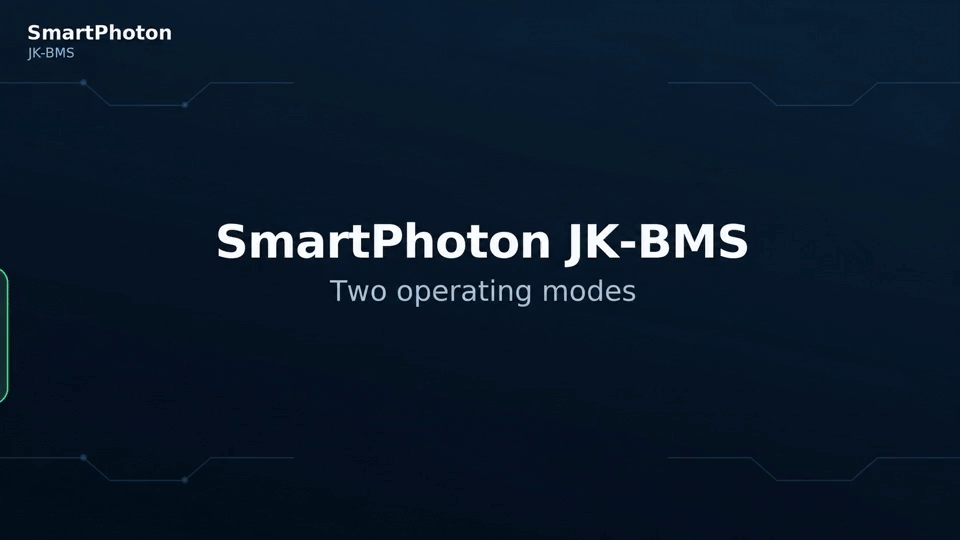
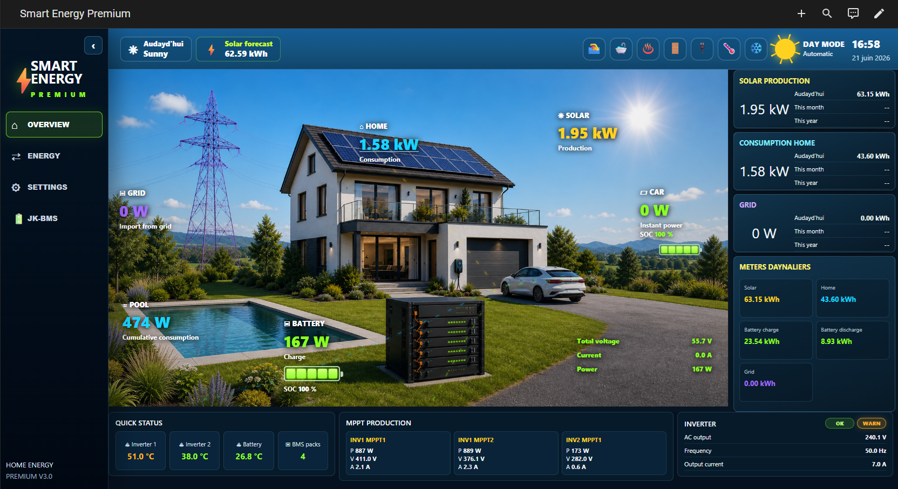
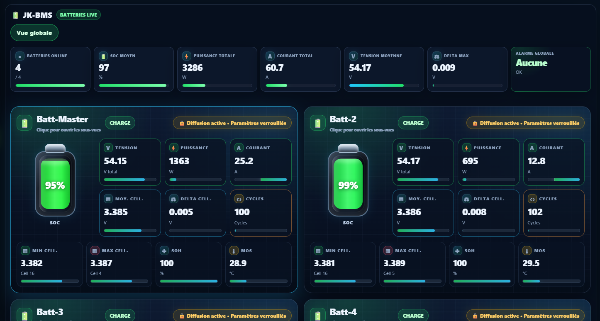

# ⚠️ DEVELOPMENT / TESTING VERSION

> **This repository contains the development version of SmartPhoton JK-BMS.**
>
> It is intended for testing and validation before release to the production repository.
> Features, configuration and dashboards may still change.
>
> **Do not use this repository for a critical production installation without a backup.**
>
> Current test focus: **Multi-Pack Broadcasting — up to 5 packs / 80 JK-BMS, TCP/IP and USB/RS485.**
⭐ **If this add-on is useful to you, please star this repository!**  
It helps other Home Assistant users discover the project and supports future development.

[](https://github.com/jean-luc1203/jkbms-rs485-addon/stargazers)
[](https://github.com/jean-luc1203/jkbms-rs485-addon)
[](https://github.com/jean-luc1203/jkbms-rs485-addon)
[](https://www.home-assistant.io/)
[](https://mqtt.org/)
[](https://github.com/jean-luc1203/jkbms-rs485-addon/tree/main/standalone)
[](https://github.com/jean-luc1203/jkbms-rs485-addon/discussions)

---

# SmartPhoton JK-BMS RS485 & CAN Bus Add-on

> **14'000+ installations worldwide** · **Community-driven development** · **Professional Home Assistant integration**

[](https://ko-fi.com/s/b704b5561d)

> **SmartPhoton Premium is available exclusively through Ko-fi.**

**SmartPhoton JK-BMS** integrates JK-BMS battery management systems into Home Assistant through **RS485 USB**, **RS485 TCP/IP gateways**, **CAN Bus**, **MQTT Discovery**, advanced diagnostics and optional **SmartPhoton Premium dashboards**.

It supports one or many BMS units, alarm monitoring, Home Assistant entities, safer operating modes, automatic dashboard generation and the SmartPhoton energy ecosystem. No expensive proprietary monitoring software is required.

---

## ⚡ Multi-Pack: up to 80 JK-BMS

> **5 independent RS485 packs × up to 16 JK-BMS per pack = up to 80 BMS managed by one SmartPhoton add-on instance.**

Each pack is isolated and can independently use **TCP/IP** or **USB/RS485** in Broadcasting mode.  
The current development lab validation is **5 packs / 12 BMS** with mixed TCP + real USB/RS485; **80 BMS is the supported architecture limit, not the number physically validated in the lab.**

## 🎬 Legacy vs Multi-Pack

Click the animation to watch the full video.

<a href="https://jean-luc1203.github.io/jkbms-rs485-addon-DEVeloppment/video.html">
  
</a>

---

## v4.2.68 — Multi-Pack test release

The current test release introduces the new **Multi-Pack architecture** while preserving the historical **Legacy** mode.

Key points:

- Up to **5 independent RS485 battery packs**, with up to **16 JK-BMS per pack** — **80 BMS maximum** in Multi-Pack Broadcasting mode.
- Each pack can independently use **TCP/IP** or a local **USB/RS485 serial adapter**.
- Mixed TCP + USB installations are supported.
- Stable pack identities: `pack_1` to `pack_5`.
- Per-pack MQTT / Home Assistant isolation plus global installation aggregation.
- Dedicated **SmartPhoton JK-BMS Multi-Pack Premium** dashboard and diagnostics.
- Compact Home Assistant Multi-Pack summaries are rate-limited to protect Recorder; richer detail remains available through MQTT and Premium views.
- Improved LIVE-based communication Health and alarm handling.
- Backward compatibility with existing Legacy installations and earlier Multi-Pack configuration files.
- Development validation includes **5 packs / 12 BMS** with four TCP simulator buses plus one real USB/RS485 bus.

> **Current limitation:** Multi-Pack supports **Broadcasting mode only** in this release. Multi-Pack Active Polling is planned for a future version.

---

## Recommended architecture for new installations

For a **new installation using Broadcasting**, start directly with **Multi-Pack**, even if you currently have only **one battery pack**. This keeps the installation on the scalable architecture from day one and allows growth up to **5 packs / 80 BMS** without changing the overall runtime model.

This gives you a stable pack identity, explicit TCP/USB transport and a direct upgrade path if a second or third pack is added later.

Use **Legacy mode** mainly for:

- existing installations that should remain unchanged;
- installations that currently require **Active Polling**;
- compatibility or troubleshooting during migration.

`multi_pack_enabled` remains `false` by default for backward compatibility, so existing users are never migrated automatically.

### Runtime architectures

| Architecture | Recommended use | Transport | Current polling support |
|---|---|---|---|
| **Multi-Pack** | Recommended for new Broadcasting installations, from 1 to 5 packs | Per pack: TCP or USB/RS485 | Up to 16 BMS/pack, 80 BMS total; Active Polling planned |
| **Legacy** | Existing installations and Active Polling | One USB/RS485 bus or one TCP gateway | Broadcasting + Active Polling |

Multi-Pack is an architecture, not a fourth RS485 protocol mode. The communication modes remain Active Polling, Broadcasting and CAN Bus.

---

## Latest video: major update + Premium dashboards

The latest video presents the main improvements made since the previous release and introduces the SmartPhoton Premium dashboard ecosystem.

▶️ **Watch the update video:**  
https://youtu.be/IA0ijoGuG54

---

## Supported BMS models

Supported JK-BMS models include:

- PB2A16S20P
- PB2A16S15P
- PB1A16S15P
- PB1A16S10P
- PB2A16S30P
- Compatible models using firmware 14, 15 or 19
- Battery packs from **1S to 16S**

---

## Key features

| Feature | Description |
|---|---|
| Variable cell count | Automatically adapts to supported packs from 1S to 16S |
| RS485 USB | Local USB/RS485 adapters with persistent `/dev/serial/by-id/...` paths |
| RS485 TCP/IP | Ethernet/Wi-Fi transparent gateways |
| Multi-BMS | Legacy single-bus operation and new independent Multi-Pack buses |
| Multi-Pack | Up to 5 independent packs × up to 16 BMS each = **80 BMS maximum**, each pack TCP or serial/USB in Broadcasting mode |
| CAN Bus | Direct CAN communication on compatible JK-BMS hardware |
| MQTT Discovery | Automatic Home Assistant devices and entities |
| Alarm monitoring | RS485 alarm monitoring and global alarm aggregation |
| Communication Health | Adaptive diagnostics, incident memory and per-BMS/per-pack analysis |
| BMS configuration | Settings can be changed when the active communication mode safely supports it |
| Premium dashboards | Automatic professional Home Assistant / HTML dashboard generation |
| Docker standalone | Can run independently from Home Assistant OS |

### Variable cell-count support

The real cell count reported by the BMS is used for minimum, maximum, average and delta calculations. Unused cell slots are excluded, avoiding misleading values on 4S, 8S, 15S and other non-16S systems.

---

# Communication modes

## 1. Active Polling — SmartPhoton RS485 Master

```yaml
bms_broadcasting: false
```

SmartPhoton queries each configured BMS directly. It can monitor live data, alarms, cells and temperatures, detect missing BMS units, measure response latency/timeouts and modify supported settings.

**Current scope:** Active Polling is supported in **Legacy** mode. Multi-Pack Active Polling is planned.

## 2. Broadcasting — JK-BMS RS485 Master

```yaml
bms_broadcasting: true
```

One JK-BMS acts as RS485 master and SmartPhoton listens to the bus. This mode supports multi-BMS reception, alarms, MQTT publishing, detected-BMS analysis and serial/TCP frame diagnostics. Settings that cannot safely be changed while listening are presented as read-only.

**Multi-Pack currently uses this mode.**

## 3. CAN Bus

CAN Bus uses the second RJ45 connector of compatible JK-BMS units for direct CAN communication and autonomous broadcast operation.

---

# Configuration

## New installation — recommended one-pack Multi-Pack USB example

Even with one pack, this is the recommended structure for a new Broadcasting installation:

```yaml
bms_broadcasting: true
multi_pack_enabled: true

multi_pack_packs:
  - id: pack_1
    name: Main battery
    transport: serial
    path: /dev/serial/by-id/usb-1a86_USB_Serial-if00-port0
```

## Multi-Pack TCP example

```yaml
bms_broadcasting: true
multi_pack_enabled: true

multi_pack_packs:
  - id: pack_1
    name: House battery
    transport: tcp
    gateway_ip_port: 192.168.1.101:5000

  - id: pack_2
    name: Garage battery
    transport: tcp
    gateway_ip_port: 192.168.1.102:5000
```

## Mixed TCP + USB example

```yaml
bms_broadcasting: true
multi_pack_enabled: true

multi_pack_packs:
  - id: pack_1
    name: House battery
    transport: tcp
    gateway_ip_port: 192.168.1.101:5000

  - id: pack_2
    name: Garage battery
    transport: serial
    path: /dev/serial/by-id/usb-FTDI_GARAGE-if00-port0
```

Each serial pack must have its **own physical USB/RS485 adapter and unique path**. The same serial path cannot be assigned to two packs.

### Multi-Pack capacity

Each independent Multi-Pack RS485 bus can contain **1 Master plus up to 15 additional JK-BMS addresses**, for **up to 16 BMS per pack**. With five packs configured, one add-on instance can therefore manage **up to 80 BMS**.

### Multi-Pack fields

| Field | Meaning |
|---|---|
| `id` | Stable technical ID: `pack_1` to `pack_5` |
| `name` | Friendly name shown in dashboards |
| `transport` | `tcp` or `serial` |
| `gateway_ip_port` | TCP endpoint such as `192.168.1.101:5000` |
| `path` | Persistent serial path such as `/dev/serial/by-id/...` |

Keep the technical `id` stable after commissioning. The friendly `name` can be changed without changing the pack identity.

For backward compatibility, earlier development configurations without explicit `transport` are still interpreted when possible, but new installations should use explicit `transport` plus `gateway_ip_port` or `path`.

## Legacy USB / RS485

```yaml
multi_pack_enabled: false
jkbms_path: /dev/serial/by-id/usb-1a86_USB_Serial-if00-port0
jkbms_count: 2
use_gateway: false
bms_broadcasting: true
```

For Legacy Active Polling:

```yaml
bms_broadcasting: false
non_broadcasting_data_interval_s: 3
```

## Legacy TCP/IP gateway

```yaml
multi_pack_enabled: false
jkbms_count: 2
use_gateway: true
gateway_ip_port: 192.168.1.100:5000
```

### Current configuration parameters

| Parameter | Description |
|---|---|
| `communication_debug` | Detailed communication logging |
| `bms_broadcasting` | `true` = Broadcasting, `false` = Active Polling in Legacy |
| `multi_pack_enabled` | Enables the Multi-Pack runtime |
| `multi_pack_packs` | Pack definitions (`id`, `name`, `transport`, endpoint/path) |
| `jkbms_path` | Legacy USB/RS485 path and backward-compatible serial fallback |
| `jkbms_count` | Total number of BMS units on the Legacy bus, 1 to 15 |
| `use_gateway` | Use the Legacy TCP/IP gateway instead of local serial |
| `gateway_ip_port` | Legacy gateway endpoint, for example `192.168.1.100:5000` |
| `non_broadcasting_data_interval_s` | Active Polling LIVE interval, 1 to 30 seconds |
| `CAN_bus_usage` | Enable CAN communication |
| `mqttadresse_port` | MQTT broker address and port |
| `mqttuser` / `mqttpass` | MQTT credentials |
| `Send_bip` | Anonymous startup usage statistic |
| `premium_key` | Optional SmartPhoton Premium license |
| `dashboard_custom_cards_installed` | Indicates whether required HA custom cards are installed |
| `dashboard_language` | Premium dashboard language: French or English |
| `dashboard_mode` | Legacy Premium only: `legacy`, `html`, or `both` |

### Finding the USB adapter path

Go to **Home Assistant → Settings → System → Hardware → All Hardware** and prefer a persistent path under:

```text
/dev/serial/by-id/...
```

Common working USB/RS485 chipsets include **FTDI**, **CH340** and **CP2102**. Persistent `/dev/serial/by-id/...` paths are preferred over `/dev/ttyUSB0`. Interfaces that appear only as `ttyACM0` are not recommended for this RS485 use case.

### TCP/IP gateway support

RS485 Ethernet/Wi-Fi gateways can be used in transparent mode when the Home Assistant host is far from the batteries or USB cabling is impractical.

[View compatible gateway models](https://github.com/jean-luc1203/jkbms-rs485-addon/tree/main/images/Modbus-Gateway)

---

# Premium dashboards

Premium is optional. The free add-on remains fully usable for JK-BMS acquisition, MQTT Discovery, Home Assistant entities, alarms, communication Health and the Multi-Pack engine.

### Free vs Premium

| Area | Free | Premium |
|---|---|---|
| JK-BMS data, USB/TCP/CAN | ✅ | ✅ |
| MQTT Discovery / HA entities | ✅ | ✅ |
| Multi-BMS / Multi-Pack engine | ✅ | ✅ |
| Alarm and Health data | ✅ | ✅ |
| Multi-Pack aggregation | ✅ | ✅ |
| Automatic professional dashboards | ❌ / manual | ✅ |
| Modern HTML interface | ❌ | ✅ |
| Dedicated Multi-Pack visual dashboard | ❌ | ✅ |
| Advanced Multi-Pack diagnostics/recommendations | Basic data | ✅ |
| Dynamic SmartPhoton module navigation | ❌ | ✅ |

### The two Premium dashboard systems

For **Legacy runtime**, `dashboard_mode` controls the two dashboard systems introduced for SmartPhoton:

- `legacy` — **Home Assistant / Lovelace dashboard** only;
- `html` — **modern HTML dashboard** only;
- `both` — generate both systems.

The HTML interface is responsive for desktop, tablet and smartphone and includes fast navigation, detailed BMS views, cell diagnostics, alarms, history charts and SmartPhoton module navigation.

For **Multi-Pack Premium**, SmartPhoton generates the dedicated **SmartPhoton JK-BMS Multi-Pack** dashboard with Overview, per-Pack/BMS views and Diagnostics. Legacy Lovelace sidebar dashboards are removed while Multi-Pack is active and are recreated automatically if the runtime returns to Legacy.

Dashboard content is currently generated in **French or English**. The Home Assistant add-on configuration interface itself has translations for **de, en, es, fr, it, pl and ru**.

### Premium previews





Premium also integrates with the shared SmartPhoton dashboard ecosystem and dynamic module menu.

---

# Home Assistant and MQTT integration

## MQTT Discovery

BMS units appear automatically as devices in the Home Assistant MQTT integration.


The add-on publishes three main MQTT data categories:

1. Live data
2. Configuration parameters
3. Static specifications

[MQTT Topics Documentation](https://github.com/jean-luc1203/jkbms-rs485-addon/blob/main/Documentation/mqtt_topics_documentation.md)

### Rich entity set

The add-on provides extensive Home Assistant entities for monitoring and automation.


### Recorder protection in Multi-Pack

Detailed Multi-Pack traffic can be very large. Home Assistant summaries are deliberately compact and rate-limited to protect Recorder, while richer detailed data remains available through MQTT and Premium dashboards.

---

# Alarm management

The add-on monitors battery/cell voltage alarms, charge/discharge overcurrent, temperature alarms, imbalance and communication conditions, and exposes alarm detail plus global alarm state for automations.

RS485 alarm monitoring is supported in both **Active Polling** and **Broadcasting**. In Broadcasting, the alarm bitmask is extracted directly from the JK LIVE frame, avoiding a separate alarm poll.

[Complete alarm reference table](https://github.com/jean-luc1203/jkbms-rs485-addon/blob/main/Documentation/Alarmes-description.md)

---

# Communication Health and diagnostics

The communication engine reconstructs frames split across several serial/TCP reads and separates multiple frames received in the same buffer. Normal transport fragmentation is not treated as a communication fault when valid JK frames are reconstructed.

Health monitoring provides `healthy`, `degraded` or `communication_error`, a quality score, readable reasons and persistent incident memory. In Active Polling, LIVE communication is the primary Health signal; auxiliary SETUP/STATIC requests are diagnostic information and do not by themselves mark an otherwise healthy BMS as failed.

Global Health follows the worst responding LIVE BMS rather than only an average success ratio.

## Unified RS485 diagnostic dashboard

The diagnostic dashboard adapts to Active Polling or Broadcast and can show requests/responses, latency, timeouts, polling cycles, per-BMS health, serial/TCP framing, detected BMS units and transport observations.

- [Communication Troubleshooting Guide](https://github.com/jean-luc1203/jkbms-rs485-addon/blob/main/Documentation/jkbms_rs485_troubleshooting_enhanced.md)
- [How to Send Diagnostic Statistics](https://github.com/jean-luc1203/jkbms-rs485-addon/blob/main/Documentation/How_to_Send_JK-BMS_Diagnostic_Statistics.md)
- [Unified Diagnostic Dashboard YAML](https://github.com/jean-luc1203/jkbms-rs485-addon/blob/main/Documentation/JK-BMS-Unified-Diagnostics-v14.yaml)

The main diagnostic entity is normally `sensor.jk_bms_aggregator_jkbms_health`. `many_short_buffers` and `high_multi_header_concat` are informational observations when complete valid frames continue to be reconstructed; the current communication state has priority over the numerical score.

---

# SmartPhoton / Simply Home Energy ecosystem

SmartPhoton JK-BMS is part of a larger Home Assistant energy ecosystem. Compatible or planned modules include:

- SmartPhoton JK-BMS
- [Pylontech / Pelio](https://github.com/jean-luc1203/Pylontech-rs232-haos)
- SmartPhoton Victron
- SmartPhoton Voltronic
- SmartPhoton Kostal
- Smart Energy Finance
- SmartPhoton HTML Dashboard

Together these modules can provide battery/BMS status, inverter and solar data, grid import/export, energy flows, financial savings, diagnostics, alarms and warnings. The dynamic menu adapts to installed SmartPhoton modules.

---

# See it in action

### Control panel


### Hardware connection guide


---

# Important safety note

This add-on is designed for monitoring, automation and energy optimization. It must **not** be the only safety layer of an electrical installation.

A failure of Home Assistant, Node-RED, MQTT, USB/RS485, TCP/IP gateway communication or the host must not by itself create a critical battery or power condition. Keep hardware protections, safe fallback behaviour and conservative defaults.

See [SAFETY.md](SAFETY.md).

---

# Installation

1. Open **Home Assistant → Settings → Add-ons → Add-on Store**.
2. Open the three-dot menu → **Repositories**.
3. Add:

```text
https://github.com/jean-luc1203/jkbms-rs485-addon
```

4. Install **JK-BMS wired management**.
5. Configure MQTT and communication settings.
6. For a new Broadcasting installation, prefer Multi-Pack even with one pack.
7. Start the add-on.

---

# Docker standalone

SmartPhoton JK-BMS can also run independently from Home Assistant OS using Docker on Linux servers, virtual machines and Docker-based Home Assistant installations.

[Docker Installation Guide](https://github.com/jean-luc1203/jkbms-rs485-addon/blob/main/standalone/README.md)

Thanks to community contributor **@SergeyYmb**.

---

# German users

Many SmartPhoton JK-BMS installations are located in Germany.

> **JK-BMS RS485 Add-on für Home Assistant**  
> Mehrere JK-BMS über RS485, TCP/IP Gateway oder CAN Bus auslesen, mit MQTT Discovery und optionalen Premium-Dashboards.

---

# Support this project

This add-on is developed and maintained in free time. Support helps fund new JK-BMS hardware, compatibility testing, bug fixes, documentation, dashboard improvements and community support.

[](https://ko-fi.com/Y8Y3YHYZP)

---

# Community & Support

Join the official Simply Home Energy Discord community:

🔗 [DISCORD_INVITE_LINK](https://discord.gg/nwVmvxYJa5)

Use GitHub Issues for reproducible bugs, installation/configuration problems and feature requests. Use GitHub Discussions / Discord for general questions and community help.

Before opening an issue:

1. Read the [FAQ](https://github.com/jean-luc1203/jkbms-rs485-addon/blob/main/FAQ.md).
2. Check existing issues.
3. Open the Unified RS485 Diagnostic Dashboard.
4. Include screenshots of relevant Overview / Advanced / Multi-Pack Diagnostics pages.
5. Include diagnostic attributes or the relevant `BMS_GLOBAL/health` MQTT payload.
6. Follow the [diagnostic statistics guide](https://github.com/jean-luc1203/jkbms-rs485-addon/blob/main/Documentation/How_to_Send_JK-BMS_Diagnostic_Statistics.md).
7. Remove MQTT passwords and Premium keys before posting logs or configuration.

| Template | When to use | Example |
|---|---|---|
| Bug report | Something is broken or crashes | No data, CRC errors, add-on crash |
| Question / Support | Installation or configuration help | USB/TCP setup question |
| Feature request | Improvement proposal | Support another BMS or mode |

---

# Roadmap

Planned work after the Multi-Pack Broadcasting test phase:

- **Multi-Pack Active Polling**;
- continued migration testing from Legacy to Multi-Pack;
- additional Docker Multi-Pack validation;
- CAN and communication diagnostics improvements;
- advanced cell-balancing analytics;
- historical/export tools;
- additional SmartPhoton dashboard modules and Premium diagnostics;
- deeper SmartPhoton ecosystem integration.

Development velocity depends on community support, available time and hardware access.

---

# Changelog

See [CHANGELOG.md](https://github.com/jean-luc1203/jkbms-rs485-addon/blob/main/CHANGELOG.md) for version history.

---

# License model

This project uses a mixed licensing model to keep the add-on accessible to private Home Assistant users while protecting professional and Premium work from unauthorized commercial reuse.

### Community add-on

The community add-on is available for private, personal and non-commercial Home Assistant use.

### Premium dashboard system

Premium dashboard templates, HTML interfaces, assets, generation logic, license validation and commercial SmartPhoton dashboard components are protected. They may not be copied, redistributed, resold, rebranded, integrated into a commercial product or offered as part of a paid installation service without the appropriate Premium/commercial authorization.

### Commercial, professional and installer use

Business, professional, installer, reseller, integrator or other commercial use requires a separate commercial license or written authorization from Simply Home Energy / SmartPhoton. This includes selling installations based on this work, bundling the add-on or Premium dashboards into a commercial offer, reusing Premium dashboards for customers, modifying/reselling the Premium interface or integrating it into another paid product/service.

If repository components are explicitly released under a separate open-source license, those files remain governed by that license.

For commercial licensing, contact the project maintainer.

---

# Credits

**Development:** Jean-Luc Martinelli (JLM)  
**Dashboard design and Premium visual ecosystem:** John  
**Inspiration:** Nolak's work for SmartPhoton  
**Docker contributor:** @SergeyYmb  
**Community:** Supporters, testers and Home Assistant users

---

## Star history

If this project is useful to you, please leave a star. It helps other Home Assistant users discover the project and motivates continued development.

[](https://github.com/jean-luc1203/jkbms-rs485-addon/stargazers)

---

**Made with ❤️ for the Home Assistant community**
